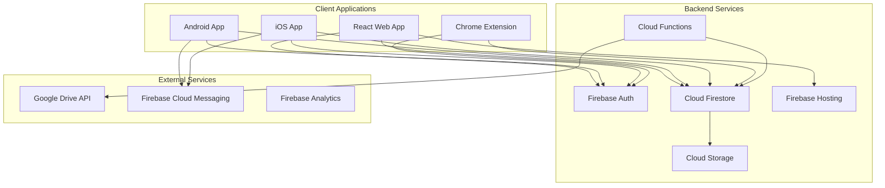

# Deployment Overview

A comprehensive guide to deploying 2FA Studio across all platforms including web, mobile, and browser extension.

## Architecture Overview

### System Components



### Technology Stack

| Component | Technology | Purpose |
|-----------|------------|---------|
| Frontend | React + TypeScript | Web and mobile UI |
| Mobile | Capacitor.js | Native mobile features |
| Backend | Firebase | Serverless infrastructure |
| Database | Firestore | NoSQL document store |
| Auth | Firebase Auth | User authentication |
| Storage | Cloud Storage | Encrypted backups |
| Functions | Node.js | Server-side logic |
| Extension | Chrome Extension API | Browser integration |

## Deployment Environments

### Environment Strategy

```yaml
environments:
  development:
    name: dev
    firebase_project: 2fa-studio-dev
    features:
      - debug_mode: true
      - analytics: false
      - rate_limiting: relaxed
    
  staging:
    name: staging
    firebase_project: 2fa-studio-staging
    features:
      - debug_mode: false
      - analytics: true
      - rate_limiting: normal
      - production_data: false
    
  production:
    name: prod
    firebase_project: 2fa-studio-prod
    features:
      - debug_mode: false
      - analytics: true
      - rate_limiting: strict
      - monitoring: enhanced
```

### Environment Variables

Core environment variables needed:

```env
# Firebase Configuration
REACT_APP_FIREBASE_API_KEY=
REACT_APP_FIREBASE_AUTH_DOMAIN=
REACT_APP_FIREBASE_PROJECT_ID=
REACT_APP_FIREBASE_STORAGE_BUCKET=
REACT_APP_FIREBASE_MESSAGING_SENDER_ID=
REACT_APP_FIREBASE_APP_ID=
REACT_APP_FIREBASE_MEASUREMENT_ID=

# App Configuration
REACT_APP_ENVIRONMENT=production
REACT_APP_VERSION=1.0.0
REACT_APP_API_ENDPOINT=

# Feature Flags
REACT_APP_ENABLE_ANALYTICS=true
REACT_APP_ENABLE_CRASH_REPORTING=true
REACT_APP_ENABLE_PERFORMANCE=true

# Third-party Services
REACT_APP_GOOGLE_DRIVE_CLIENT_ID=
REACT_APP_SENTRY_DSN=
```

## Pre-Deployment Checklist

### 1. Code Preparation

- [ ] All tests passing
- [ ] Code linting passed
- [ ] Security audit completed
- [ ] Dependencies updated
- [ ] Version bumped
- [ ] Changelog updated
- [ ] Documentation current

### 2. Configuration

- [ ] Environment variables set
- [ ] Firebase project configured
- [ ] API keys secured
- [ ] Domain verified
- [ ] SSL certificates ready
- [ ] CDN configured

### 3. Security

- [ ] Security rules tested
- [ ] API rate limiting configured
- [ ] CORS policies set
- [ ] CSP headers configured
- [ ] Secrets rotated
- [ ] Backup encryption verified

### 4. Performance

- [ ] Bundle size optimized
- [ ] Images optimized
- [ ] Code splitting implemented
- [ ] Lazy loading configured
- [ ] Cache policies set
- [ ] CDN warming completed

## Deployment Pipeline

### CI/CD Overview

```yaml
name: Deploy Pipeline

stages:
  - build
  - test
  - security
  - deploy

build:
  stage: build
  script:
    - yarn install --frozen-lockfile
    - yarn build
    - yarn build:android
    - yarn build:ios
    - yarn build:extension
  artifacts:
    paths:
      - build/
      - android/app/build/
      - ios/build/
      - extension/dist/

test:
  stage: test
  script:
    - yarn test:unit
    - yarn test:integration
    - yarn test:e2e
    - yarn test:security

security:
  stage: security
  script:
    - yarn audit
    - yarn scan:vulnerabilities
    - yarn test:penetration

deploy:
  stage: deploy
  script:
    - ./scripts/deploy.sh $ENVIRONMENT
  only:
    - main
    - production
```

### Deployment Flow

1. **Development** → Feature branches
2. **Staging** → Main branch
3. **Production** → Tagged releases

## Platform-Specific Deployments

### Web Application
- Firebase Hosting
- CloudFlare CDN
- Automatic SSL
- Global edge locations

### Mobile Applications
- Google Play Store (Android)
- Apple App Store (iOS)
- Beta testing tracks
- Phased rollouts

### Browser Extension
- Chrome Web Store
- Edge Add-ons store
- Manual review process
- Automatic updates

## Monitoring and Rollback

### Monitoring Setup

```javascript
// monitoring.config.js
module.exports = {
  services: {
    performance: {
      enabled: true,
      sampleRate: 0.1,
      metrics: ['FCP', 'LCP', 'CLS', 'FID']
    },
    errors: {
      enabled: true,
      sampleRate: 1.0,
      integrations: ['Sentry', 'Firebase Crashlytics']
    },
    analytics: {
      enabled: true,
      events: ['user_action', 'error', 'performance']
    },
    uptime: {
      enabled: true,
      endpoints: ['/health', '/api/status'],
      interval: 60 // seconds
    }
  }
};
```

### Rollback Strategy

1. **Immediate Rollback** (< 5 minutes)
   ```bash
   firebase hosting:rollback
   ```

2. **Version Rollback** (< 1 hour)
   ```bash
   git revert <commit>
   yarn deploy:emergency
   ```

3. **Full Rollback** (> 1 hour)
   - Restore from backup
   - Notify users
   - Investigate root cause

### Health Checks

Automated health checks monitor:
- API endpoints
- Database connectivity
- Authentication service
- Third-party integrations
- Performance metrics

## Security Considerations

### Data Protection

1. **Encryption**
   - At rest: AES-256
   - In transit: TLS 1.3
   - Client-side: AES-256-GCM

2. **Access Control**
   - Role-based permissions
   - API key rotation
   - IP whitelisting
   - Rate limiting

3. **Compliance**
   - GDPR compliant
   - SOC 2 Type II
   - ISO 27001
   - Privacy Shield

### Security Headers

```nginx
# nginx.conf
add_header Strict-Transport-Security "max-age=31536000; includeSubDomains" always;
add_header X-Frame-Options "SAMEORIGIN" always;
add_header X-Content-Type-Options "nosniff" always;
add_header Referrer-Policy "strict-origin-when-cross-origin" always;
add_header Content-Security-Policy "default-src 'self'; script-src 'self' 'unsafe-inline' https://apis.google.com; style-src 'self' 'unsafe-inline'; img-src 'self' data: https:; font-src 'self' data:;" always;
```

## Performance Optimization

### Web Performance

1. **Bundle Optimization**
   - Code splitting by route
   - Tree shaking
   - Minification
   - Compression (gzip/brotli)

2. **Caching Strategy**
   ```javascript
   // cache.config.js
   {
     'index.html': 'no-cache',
     '*.js': 'max-age=31536000',
     '*.css': 'max-age=31536000',
     'assets/*': 'max-age=604800'
   }
   ```

3. **CDN Configuration**
   - Global edge locations
   - Automatic failover
   - DDoS protection
   - SSL termination

### Mobile Performance

1. **App Size**
   - Target: < 50MB (Android)
   - Target: < 100MB (iOS)
   - Use app bundles
   - Dynamic feature modules

2. **Startup Time**
   - Cold start: < 2 seconds
   - Warm start: < 0.5 seconds
   - Lazy loading
   - Preload critical resources

## Deployment Tools

### Required Tools

```bash
# Global tools
npm install -g firebase-tools
npm install -g @capacitor/cli

# Development dependencies
yarn add --dev @sentry/cli
yarn add --dev bundlesize
yarn add --dev lighthouse
```

### Deployment Scripts

```json
// package.json
{
  "scripts": {
    "deploy:web": "yarn build && firebase deploy --only hosting",
    "deploy:functions": "firebase deploy --only functions",
    "deploy:rules": "firebase deploy --only firestore:rules,storage:rules",
    "deploy:all": "yarn deploy:rules && yarn deploy:functions && yarn deploy:web",
    "deploy:android": "yarn build:android && ./scripts/deploy-android.sh",
    "deploy:ios": "yarn build:ios && ./scripts/deploy-ios.sh",
    "deploy:extension": "yarn build:extension && ./scripts/deploy-extension.sh"
  }
}
```

## Post-Deployment

### Verification Steps

1. **Functional Testing**
   - Core features working
   - Authentication flow
   - Data sync
   - Backup/restore

2. **Performance Testing**
   - Page load times
   - API response times
   - Resource usage
   - Error rates

3. **Security Testing**
   - Penetration testing
   - SSL verification
   - Security headers
   - API security

### User Communication

1. **Release Notes**
   - New features
   - Bug fixes
   - Breaking changes
   - Migration guide

2. **In-App Notifications**
   - Update available
   - New features
   - Maintenance windows
   - Security advisories

## Disaster Recovery

### Backup Strategy

```yaml
backups:
  database:
    frequency: hourly
    retention: 30 days
    locations: [us-central1, europe-west1]
  
  user_data:
    frequency: daily
    retention: 90 days
    encryption: AES-256
  
  configuration:
    frequency: on_change
    retention: unlimited
    version_control: git
```

### Recovery Procedures

1. **Data Loss**
   - Restore from automated backup
   - Verify data integrity
   - Notify affected users
   - Document incident

2. **Service Outage**
   - Activate failover
   - Scale resources
   - Monitor recovery
   - Post-mortem analysis

## Continuous Improvement

### Metrics to Track

- Deployment frequency
- Lead time for changes
- Mean time to recovery (MTTR)
- Change failure rate
- User satisfaction scores
- Performance metrics

### Regular Reviews

- Weekly: Deployment metrics
- Monthly: Security audit
- Quarterly: Architecture review
- Yearly: Disaster recovery drill

## Next Steps

Ready to deploy? Follow the platform-specific guides:

1. [Web Deployment Guide](./web-deployment.md)
2. [Mobile Deployment Guide](./mobile-deployment.md)
3. [Extension Deployment Guide](./extension-deployment.md)
4. [Firebase Setup Guide](./firebase-setup.md)
5. [Environment Variables Guide](./environment-variables.md)